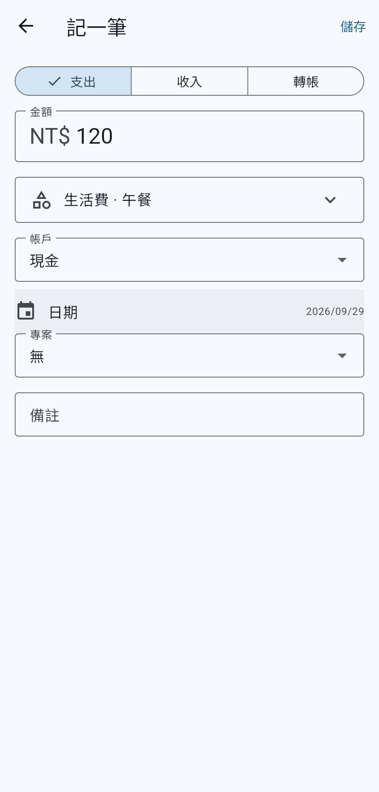
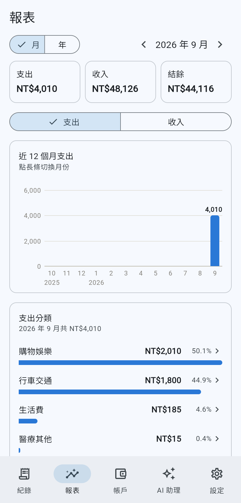
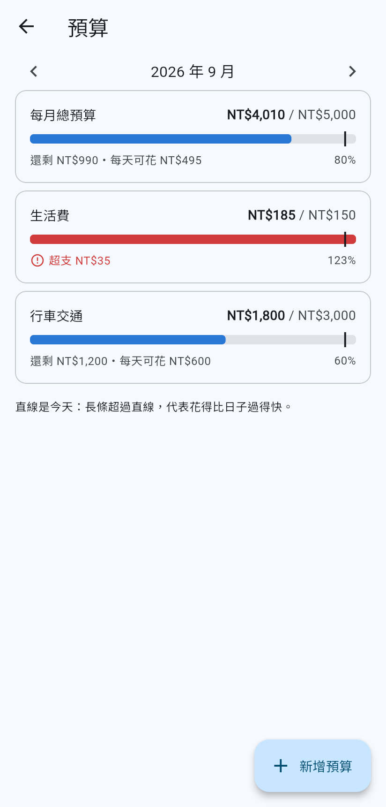
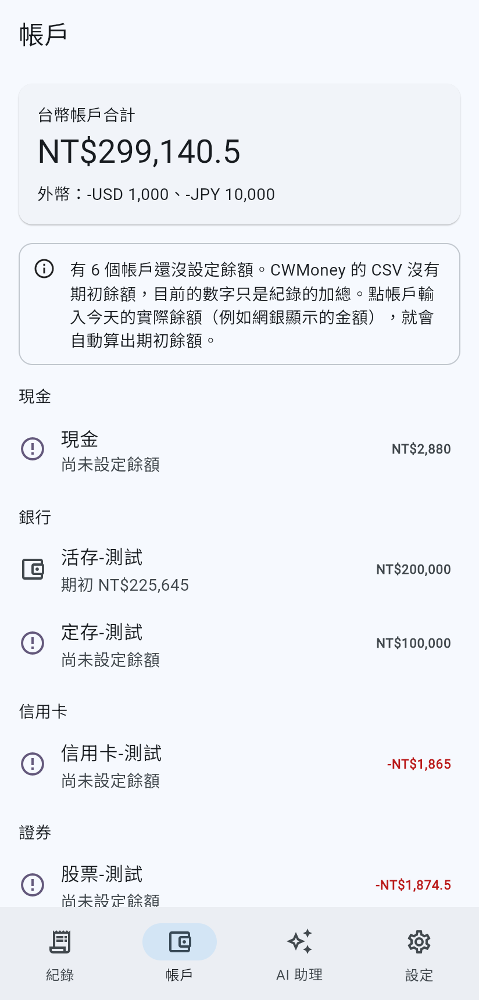

# Aura 記帳

免費的手機記帳 App：

- **可以從頭開始記帳**：第一次打開選「從頭開始」，會建立常用分類和一個現金帳戶，然後就能記支出、收入、轉帳（含外幣），也可以附上收據照片，或直接掃描紙本發票的 QR Code 記帳（會依你以前的紀錄自動選分類）。
- **搜尋**：用關鍵字（備註、地點、商家、發票品項）找紀錄，再依類型、日期、帳戶、分類、金額篩選，馬上看到筆數和合計。
- **報表**：每週／每月／每年的支出、收入、結餘和上一期比較，近 12 期的趨勢，依分類、帳戶或專案的占比（點進去看明細），以及淨資產走勢。每個月還有「**本月重點**」：和平常比起來花多花少、哪些分類變化最大、特別大的支出、可能重複記帳或扣款、預算狀況；按「請 AI 寫月報」就交給 AI 寫成月報。
- **週期收支**：房租、薪水、訂閱、信用卡分期設定一次，到期打開 App 就自動記好（沒開的日子會補記）。App 也會從過去的紀錄找出「看起來是固定收支」的項目，一鍵加入。
- **預算**：設定每月總預算或分類預算，看還剩多少、每天還可以花多少，花太快或超支時會提醒。「省錢試算」可以試試「外食每月少 3 次」「娛樂少兩成」一年能省多少，再一鍵設成預算。
- **App 鎖**：PIN 碼或指紋／臉部解鎖，離開 App 一段時間後自動上鎖，切換 App 時也不會露出金額。
- **隱藏帳戶與資產總覽**：不想被看到的帳戶可以隱藏（紀錄、報表、AI 都看不到）；帳戶頁顯示淨資產、資產和負債，外幣自動換算成台幣。
- **記錄位置（選用）**：打開後，新增的紀錄會記下當時的大概位置；預設關閉，也不會送給 AI。
- **備份與還原**：建立 `.aura` 備份檔（可以設密碼，AES-256 加密），存到 Google Drive、iCloud 或任何地方，換手機時還原。也可以開啟**雲端備份**，每天自動加密備份到自己的 Google 雲端硬碟或 WebDAV（Nextcloud、NAS…）。手機上也會每天、以及匯入和還原之前自動保留快照，操作失誤可以救回。
- **相容 CWMoney**：也可以直接匯入 CWMoney 經典版匯出的 CSV（新版 CSV 和舊版 Excel HTML 格式都可以）。匯入後輸入各帳戶今天的實際餘額，就會自動算出期初餘額。之後在 CWMoney 匯出的新月份可以**合併**進來，已經有的紀錄會自動略過。也可以**匯出**成同樣格式的 CSV，給 Excel 或其他 App 用。
- **AI 自己接**：用自己的 OpenAI API 金鑰，或任何 OpenAI 相容服務、本機模型、自己寫的 Agent，用自然語言分析自己的收支；AI 用來回答的彙總數字會直接畫成圖表。

沒有帳號、沒有廣告，也沒有 Aura 伺服器。資料存在手機的 SQLite 資料庫裡；AI 要查什麼，由手機在本機算好再交給你選的 AI。

| 記一筆 | 紀錄 | 報表 | 預算 | 帳戶與期初餘額 | AI 連線設定 | AI 助理（可以看到送出了什麼） |
|---|---|---|---|---|---|---|
|  |  |  |  |  |  |  |

> 截圖用的是 `packages/aura_core/test/fixtures/` 裡的虛構資料，以及 `examples/mock_agent.py` 範例 Agent。

## 專案結構

```
app/                    Flutter App（iOS / Android / Web）
  lib/screens/          紀錄、報表、預算、週期收支、帳戶、AI 助理、AI 連線設定、設定
  lib/cloud/            雲端備份（WebDAV、Google 雲端硬碟）
  lib/lock/             App 鎖
  lib/widgets/          圖表
packages/
  aura_core/            資料模型、帳本查詢、報表與預算計算、週期收支與固定收支偵測、月報重點、
                        電子發票 QR Code、CWMoney 匯入／合併／匯出（純 Dart）
  aura_ai/              AI 連線（OpenAI 相容）、帳本工具、Agent 迴圈（純 Dart）
  aura_store/           SQLite 儲存與 schema migration
examples/mock_agent.py  最小的自訂 Agent 範例（只用 Python 標準函式庫）
tool/                   開發工具（Big5-HKSCS 對照表產生器）
docs/
  PROPOSAL.md           專案提案
  backup-format.md      .aura 備份檔格式
  cloud-backup.md       雲端備份：運作方式、WebDAV、Google 雲端硬碟的 OAuth 設定
  cwmoney-format.md     CWMoney 匯出格式規格（逆向分析）
  ai-agent-api.md       接自己的 AI Agent：協定與工具規格
  ai-eval.md            AI 評測集：比較不同模型答對多少
```

## 開發

需要 Flutter 3.47 以上（Dart 3.10 以上）。第一次 build 時，`sqlite3` 套件會透過 build hook 自動準備 SQLite 的 native library。

```bash
# 核心套件
(cd packages/aura_core && dart pub get && dart test)
(cd packages/aura_ai && dart pub get && dart test)
(cd packages/aura_store && dart pub get && dart test)

# App
cd app
flutter pub get
flutter test
flutter run            # 接手機或模擬器
flutter run -d chrome  # 網頁版，方便開發
```

### 試用 AI 助理，不需要 API 金鑰

```bash
python3 examples/mock_agent.py 8766
```

在 App 裡：**設定 → AI 連線 → 自訂 Agent API**，網址填 `http://localhost:8766/v1`（Android 模擬器填 `http://10.0.2.2:8766/v1`），模型填 `mock-agent`。然後匯入 `packages/aura_core/test/fixtures/sample_cwmoney.csv`，到「AI 助理」提問。

要用真正的 AI，選 **OpenAI** 並填入你的 API 金鑰即可。

想比較不同模型答得準不準，可以跑評測集（見 [`docs/ai-eval.md`](docs/ai-eval.md)）：

```bash
cd packages/aura_ai
OPENAI_API_KEY=sk-... dart run bin/eval.dart --model gpt-6-sol
```

## 授權

版權所有，保留一切權利。App 免費提供使用，但原始碼不開源，未經授權不得複製、修改或散布。

## 隱私

- 帳本存在 App 私有目錄的 `aura.db`（SQLite），Aura 自己不會上傳。手機系統的整機備份（Android 的 Google 備份、iCloud 備份）會像其他 App 的資料一樣把它一起備份；API 金鑰、App 鎖 PIN 和雲端備份密碼存在 Keychain／Keystore，換手機後要重新設定。網頁版只把資料放在記憶體裡，不會保存。
- API 金鑰只存在手機的 Keychain／Keystore。
- 送給 AI 的只有你的問題，以及工具查詢的結果。手機條碼載具號碼和賣方統編一律不送；卡號、帳號這類長串數字會遮蔽。
- 每一次查詢送出的內容，都可以在對話裡點開檢查。
- 照片不含位置資訊；紀錄的位置只在你打開「記帳時記錄位置」後才會記，只存在手機和你的備份裡。
- 真實的 CWMoney 匯出檔含有個人財務資料，`.gitignore` 已經排除，請不要 commit。
