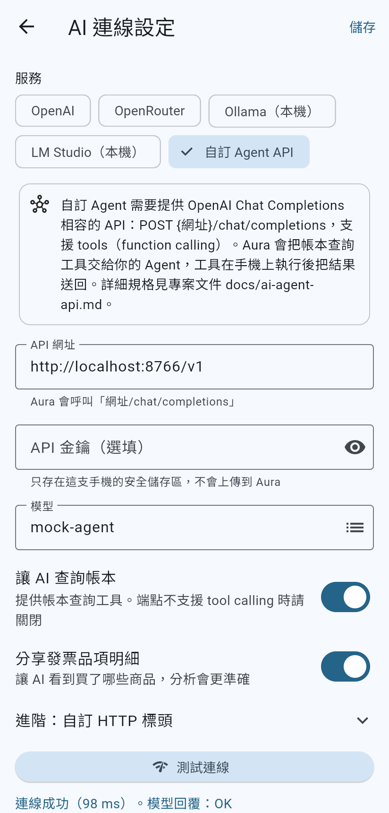
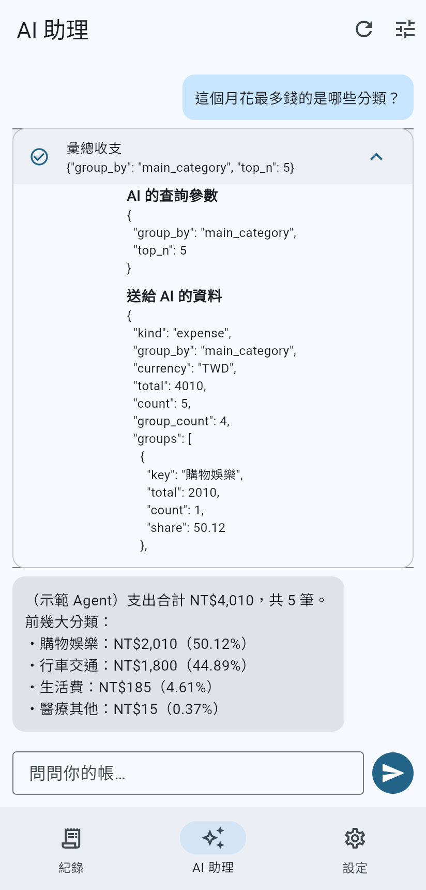
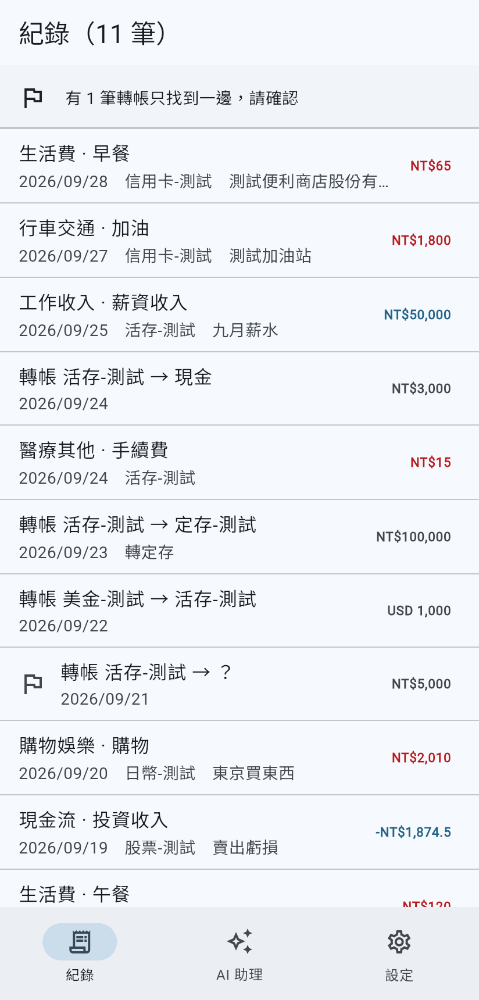

# Aura 記帳

免費的手機記帳 App：

- **相容 CWMoney**：直接匯入 CWMoney 經典版匯出的 CSV。
- **AI 自己接**：用自己的 OpenAI API 金鑰，或任何 OpenAI 相容服務、本機模型、自己寫的 Agent，用自然語言分析自己的收支。

沒有帳號、沒有廣告，也沒有 Aura 伺服器。資料存在手機的 SQLite 資料庫裡；AI 要查什麼，由手機在本機算好再交給你選的 AI。

| AI 連線設定 | AI 助理（可以看到送出了什麼） | 紀錄 |
|---|---|---|
|  |  |  |

> 截圖用的是 `packages/aura_core/test/fixtures/` 裡的虛構資料，以及 `examples/mock_agent.py` 範例 Agent。

## 專案結構

```
app/                    Flutter App（iOS / Android / Web）
  lib/screens/          紀錄、AI 助理、AI 連線設定、設定
packages/
  aura_core/            資料模型、帳本查詢、CWMoney 匯入（純 Dart）
  aura_ai/              AI 連線（OpenAI 相容）、帳本工具、Agent 迴圈（純 Dart）
  aura_store/           SQLite 儲存與 schema migration
examples/mock_agent.py  最小的自訂 Agent 範例（只用 Python 標準函式庫）
tool/                   開發工具（Big5-HKSCS 對照表產生器）
docs/
  PROPOSAL.md           專案提案
  cwmoney-format.md     CWMoney 匯出格式規格（逆向分析）
  ai-agent-api.md       接自己的 AI Agent：協定與工具規格
```

## 開發

需要 Flutter 3.47 以上（Dart 3.10 以上）。第一次 build 時，`sqlite3` 套件會透過 build hook 自動準備 SQLite 的 native library。

```bash
# 核心套件
(cd packages/aura_core && dart pub get && dart test)
(cd packages/aura_ai && dart pub get && dart test)
(cd packages/aura_store && dart pub get && dart test)

# App
cd app
flutter pub get
flutter test
flutter run            # 接手機或模擬器
flutter run -d chrome  # 網頁版，方便開發
```

### 試用 AI 助理，不需要 API 金鑰

```bash
python3 examples/mock_agent.py 8766
```

在 App 裡：**設定 → AI 連線 → 自訂 Agent API**，網址填 `http://localhost:8766/v1`（Android 模擬器填 `http://10.0.2.2:8766/v1`），模型填 `mock-agent`。然後匯入 `packages/aura_core/test/fixtures/sample_cwmoney.csv`，到「AI 助理」提問。

要用真正的 AI，選 **OpenAI** 並填入你的 API 金鑰即可。

## 隱私

- 帳本存在 App 私有目錄的 `aura.db`（SQLite），不會上傳。網頁版只把資料放在記憶體裡，不會保存。
- API 金鑰只存在手機的 Keychain／Keystore。
- 送給 AI 的只有你的問題，以及工具查詢的結果。手機條碼載具號碼和賣方統編一律不送；卡號、帳號這類長串數字會遮蔽。
- 每一次查詢送出的內容，都可以在對話裡點開檢查。
- 真實的 CWMoney 匯出檔含有個人財務資料，`.gitignore` 已經排除，請不要 commit。
